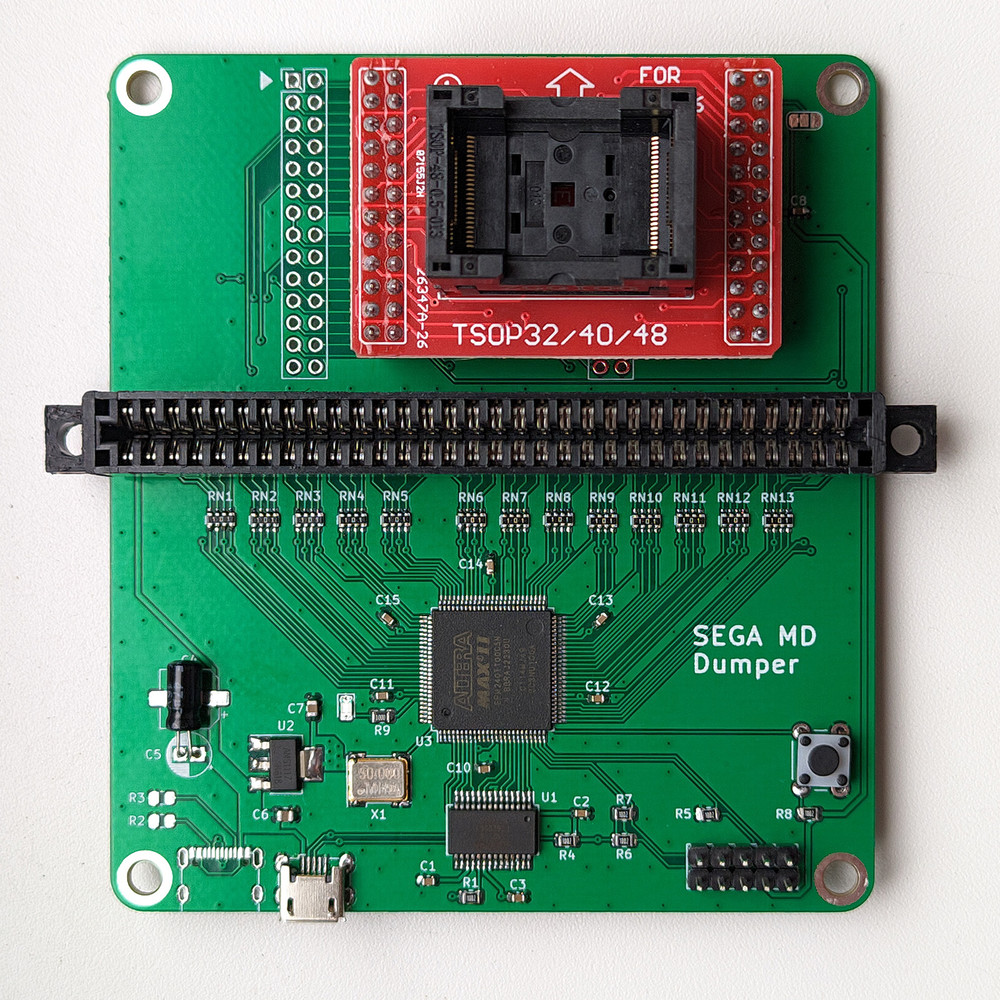
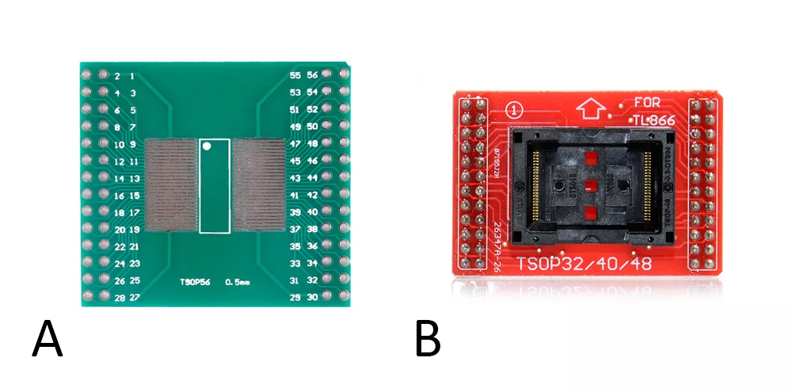
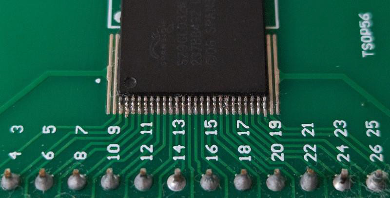

#### Flashkit MD дампер картриджей для Sega Mega Drive

Данный дампер/программатор позволяет читать и перезаписывать совместимые картриджи. Главное отличие данного форка - это возможность использовать адаптеры для флэш памяти в корпусах TSOP48, таким образом можно выпаять память из несовместимого картриджа и перезаписать её. При этом swap byte для записываемого ROM делать не нужно!

**Схема**
[Schematic PDF](Flashkit-Pics/Flashkit-Schematic.pdf)

**Интерактивный BOM**
[BoM](BOM/Flashkit-iBOM.html) (для корректного просмотра нужно скачать raw файл)

**Прошивка**
В папке Flashkit-Firmware находятся исходники проекта для Quartus, логика не менялась, был изменен порядок выводов EPM240.

**Софт**
В папке Flashkit-Soft находится программа для работы с Flashkit и её исходники. Продвинутую версию программы от MiGeRA можно [скачать здесь](https://github.com/MiGeRA/FlashKit-MD-Plus).

**Использование адаптеров**
В продаже можно найти дешевые TSOP56 адаптеры под пайку (A) и TSOP48 адаптер для TL866 (B), нужна только верхняя часть с кроваткой для микросхемы. Учтите, что у дампера для разных адаптеров свое посадочное место. Для того, чтобы программа увидела адаптер с установленной памятью, необходимо соединить перемычку "FLASH" на плате дампера.

При запайке чипа памяти в адаптер TSOP56, выводы микросхемы должны располагаться посередине посадочной площадки, т.е. сверху и снизу должно быть свободно по 2 контактные площадки.

Спасибо [**Krikzz**](https://github.com/krikzz) за этот отличный дампер.
Проект создан в [**KiCad 9**](https://www.kicad.org/).
PS Герберы не выкладываю специально - это мой небольшой вклад в популяризацию KiCad :smile:
